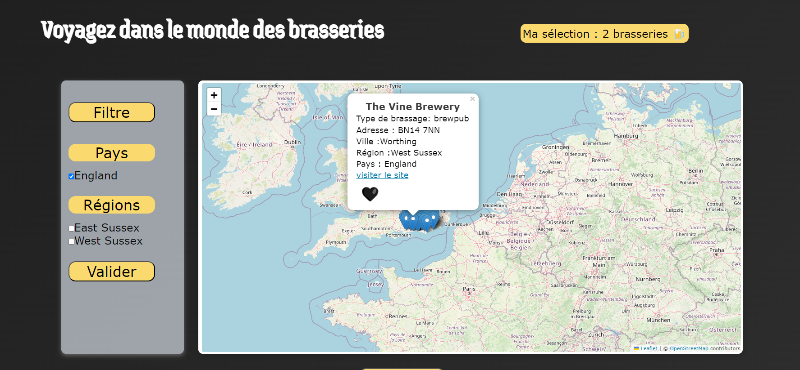
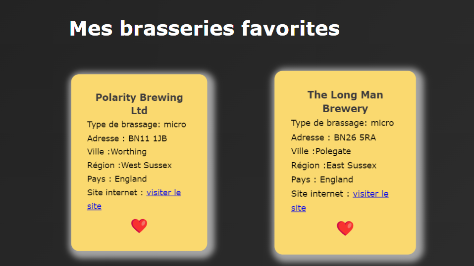
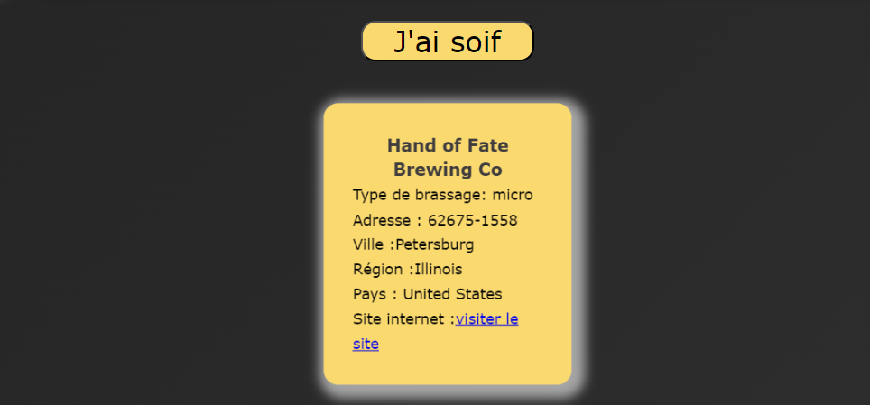

# projet2

Mon 2e projet à la Wild code school Le but de ce projet était d'apprendre à récupérer les données d'une API dans une application React, puis à les utiliser dans toute l'application grâce à useContext et aux props..

 Mes coéquipiers et moi avons choisi une API sur les brasseries du monde entier, en nous concentrant sur celles situées en Europe.
 
 
  Dans notre application, vous pouvez consulter une carte affichant les brasseries à travers l'Europe, avec leurs informations et coordonnées. Un bouton 'Favoris' vous permet d'ajouter des brasseries à votre liste personnelle de favoris, que vous pouvez ensuite consulter sur la page dédiée 'Mes Favoris'. Vous avez également la possibilité de filtrer les brasseries par pays, région et ville.

  

  

  Une autre function est un bouton "J'ai soif" grace  à ce bouton vous pouvez avoir une card d'un brasserie aleratoire partout dans le monde.

  